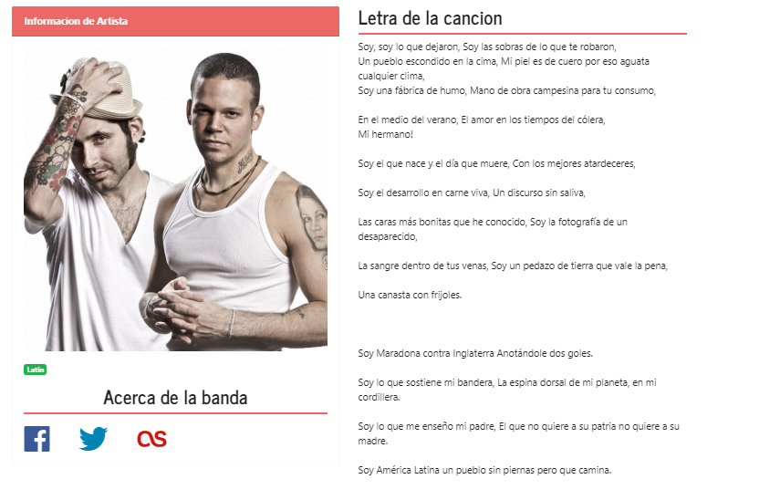
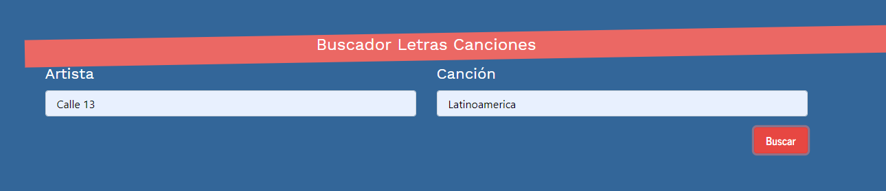

# Lyrics App
#### Lucas Angelino - [https://github.com/lucasangelino](https://github.com/lucasangelino)

Lyrics is a very basic SPA. It don't use Hooks as it was created just for learning porpuses. It is a lyrics search engine. You will be able to search your favourites songs and acess to the band´s social media such as Facebook.

## API

### **Run the App**

#### Visit: 
[Lyrics App](https://jovial-shaw-a10135.netlify.com/)

#### Or do the following: 
1. Download the repo and to into its folder
2. Execute **"npm install"** to
3. Start searching

#### This is how the App looks like:

